# ORBIT Phase 2 Normalized Data Model

This document designs the normalized ORBIT Phase 2 data model from [`phase2-data-audit.md`](./phase2-data-audit.md). It is a schema and relationship design only.

No database is implemented by this document. The raw files in `D:\ORBIT\Data` are immutable inputs. No Digital Twin, agents, simulation, optimization, recommendation engine, predictive ML, mock data, synthetic values, or Phase 1 UI changes are part of this design.

## 1. Design principles

1. Preserve every source file in an immutable staging layer before normalization.
2. Retain source names, codes, row identifiers, and original units alongside canonical fields.
3. Use ORBIT surrogate keys for canonical entities, but never replace source identifiers with them.
4. Treat unresolved mappings as explicit data states, not as null-safe joins that silently lose rows.
5. Do not infer a port, refinery, lane, chokepoint, country, unit, or route relationship from a name or geography unless it is explicitly mapped and reviewed.
6. Keep facts at their source grain and unit. Do not reconcile or combine measures merely because they are all related to energy.
7. Use nullable fields for unavailable source facts. Do not fill missing values with zeros, estimates, or defaults.
8. Keep snapshot dates and observation periods separate. A source retrieval date is not an observation date.
9. Store all financial-year labels in a shared financial-period dimension while preserving the original source label.
10. Treat the current model as a foundation for later Digital Twin relationships, not as a Digital Twin implementation.

### 1.1 Logical type notation

The types below are logical database types, not an instruction to select a database engine.

| Type | Meaning |
|---|---|
| `UUID` | ORBIT-generated canonical identifier; generated only during implementation |
| `TEXT` | Source or canonical string |
| `INTEGER` | Whole-number value |
| `DECIMAL(p,s)` | Exact numeric value; precision/scale are logical recommendations |
| `DATE` | Calendar date without time |
| `TIMESTAMPTZ` | Timestamp with timezone |
| `BOOLEAN` | True/false value |
| `JSON` | Preserved structured source metadata |
| `GEOMETRY` | Spatial geometry; CRS must be retained separately |

`Required` below means required for a valid normalized record. A nullable canonical foreign key may remain empty while its source identity is in `UNRESOLVED` or `MANUAL_REVIEW` state; the source row must still be preserved.

## 2. Conceptual network

The model is intended to represent this network when the relevant evidence exists:

```text
Supplier Country
      |
      v
SupplierImport / CrudeImportTotal
      |
      v
ImportRouteLink              (currently unresolved)
      |
      v
ShippingLane <-> Chokepoint  (currently unresolved)
      |
      v
Port <-> PortSourceIdentity
      |
      v
Refinery <-> RefineryPortLink (currently unresolved)
      |
      v
PetroleumConsumption / Demand
      |
      v
StrategicReserve             (schema only; no supplied data)
```

The arrows indicate possible future relationships, not relationships that may be populated from the current files without mapping or additional sources.

## 3. Entity list

### 3.1 Core reference and metadata entities

- `DataSource`
- `FinancialPeriod`
- `Country`
- `CountryAlias`
- `Region`
- `Product`
- `ProductAlias`
- `UnitDefinition`

### 3.2 Infrastructure and network entities

- `Port`
- `PortSourceIdentity`
- `Refinery`
- `ShippingLane`
- `ShippingLaneGeometry`
- `Chokepoint`
- `RefineryPortLink`
- `PortShippingLaneLink`
- `ChokepointShippingLaneLink`
- `ImportRouteLink`
- `StrategicReserve`

### 3.3 Fact entities

- `SupplierImport`
- `CrudeImportTotal`
- `PetroleumConsumption`
- `DailyPortActivity`
- `GlobalOilSnapshot`

### 3.4 Governance entity

- `DataQualityIssue`

## 4. Schema tables

## 4.1 `DataSource`

**Purpose:** Records the provenance, coverage, retrieval metadata, and declared units for every imported dataset. This is the parent provenance record for staging and normalized facts.

**Primary key:** `data_source_id`.

| Field | Type | Required | Unit | Source / notes |
|---|---|---:|---|---|
| `data_source_id` | UUID | Yes | n/a | ORBIT-generated key |
| `source_name` | TEXT | Yes | n/a | Human-readable source name |
| `source_file_name` | TEXT | Yes | n/a | For example `supplier_crude_imports_2014_2017.csv` |
| `source_format` | TEXT | Yes | n/a | `CSV`, `GeoJSON`, or `README` |
| `publisher` | TEXT | No | n/a | Only when documented |
| `source_dataset_name` | TEXT | No | n/a | Upstream dataset name when known |
| `source_version` | TEXT | No | n/a | `v1` is known for the lane filename; otherwise nullable |
| `retrieved_at` | TIMESTAMPTZ | No | n/a | Load/retrieval time; not an observation date |
| `observation_start` | DATE | No | n/a | Nullable when not supplied |
| `observation_end` | DATE | No | n/a | Nullable when not supplied |
| `as_of_date` | DATE | No | n/a | Nullable for global oil and World Port Index until confirmed |
| `declared_unit_notes` | TEXT | No | n/a | README/source unit notes |
| `source_notes` | TEXT | No | n/a | Cleaning and coverage notes |

**Relationships and foreign keys:** Referenced by all staging/fact/entity records through `data_source_id`.

**Data-quality constraints:** `source_file_name` must be unique within an import package; observation dates must not be invented; retrieval and observation dates must be stored separately.

## 4.2 `FinancialPeriod`

**Purpose:** Canonical fiscal-period dimension for consumption, supplier imports, and national crude-import totals, which currently use different label formats and time ranges.

**Primary key:** `financial_period_id`.

| Field | Type | Required | Unit | Source / notes |
|---|---|---:|---|---|
| `financial_period_id` | UUID | Yes | n/a | ORBIT-generated key |
| `financial_year_start` | INTEGER | Yes | calendar year | Four-digit start year, such as 2014 |
| `financial_year_label` | TEXT | Yes | n/a | Canonical label, such as `2014-15` |
| `source_financial_year_label` | TEXT | No | n/a | Preserves `2014-2015` vs `2014-15` formatting |
| `start_date` | DATE | No | n/a | Populate only when fiscal-calendar convention is confirmed |
| `end_date` | DATE | No | n/a | Populate only when fiscal-calendar convention is confirmed |
| `fiscal_month_count` | INTEGER | No | months | Expected 12 for current annual periods |
| `calendar_system` | TEXT | No | n/a | For example `APRIL_MARCH`; source-confirmed only |

**Relationships and foreign keys:** Referenced by `SupplierImport`, `CrudeImportTotal`, and `PetroleumConsumption`.

**Data-quality constraints:** One canonical key per normalized financial-year label; retain the original label; do not merge periods with different source semantics; do not infer a daily observation date from a financial-year label.

## 4.3 `Country`

**Purpose:** Canonical country or territory dimension used by supplier imports, global oil snapshots, ports, and later infrastructure relationships.

**Primary key:** `country_id`.

| Field | Type | Required | Unit | Source / notes |
|---|---|---:|---|---|
| `country_id` | UUID | Yes | n/a | ORBIT-generated key |
| `canonical_name` | TEXT | Yes | n/a | Canonical name after review |
| `iso3` | TEXT | No | ISO3 code | Not available in global or supplier source files; populate only when mapped |
| `iso2` | TEXT | No | ISO2 code | Optional standard code |
| `country_type` | TEXT | No | n/a | Country, territory, or other reviewed classification |
| `region_id` | UUID FK | No | n/a | `Region`; no region mapping is supplied currently |
| `mapping_status` | TEXT | Yes | enum | `CANONICAL`, `MANUAL_REVIEW`, or `UNRESOLVED` |
| `notes` | TEXT | No | n/a | Review and provenance notes |

**Source datasets:** `global_oil_country.csv`, `supplier_crude_imports_2014_2017.csv`, `india_daily_port_activity_2019_2024.csv`, and `india_world_port_index.csv` provide country text; none provides a complete shared country key.

**Relationships and foreign keys:** One `Country` has many `CountryAlias`, `SupplierImport`, `GlobalOilSnapshot`, and `Port` records. `region_id` references `Region`.

**Data-quality constraints:** `canonical_name` must be unique among canonical records; `iso3` must be unique when present; unresolved source names must not be silently inserted as canonical countries; the replacement-character country label and `Unspecified` require review.

## 4.4 `CountryAlias`

**Purpose:** Preserves source country labels and maps them to canonical countries without overwriting source values.

**Primary key:** `country_alias_id`.

| Field | Type | Required | Unit | Source / notes |
|---|---|---:|---|---|
| `country_alias_id` | UUID | Yes | n/a | ORBIT-generated key |
| `data_source_id` | UUID FK | Yes | n/a | Source dataset |
| `country_id` | UUID FK | No | n/a | Null until mapped |
| `source_country_code` | TEXT | No | n/a | Supplier `country_code`; coding standard is undocumented |
| `source_country_name` | TEXT | Yes | n/a | Original country field |
| `normalized_source_name` | TEXT | No | n/a | Mechanical normalization only; not canonical approval |
| `mapping_status` | TEXT | Yes | enum | `MAPPED`, `MANUAL_REVIEW`, `UNRESOLVED` |
| `mapping_method` | TEXT | No | n/a | Exact match, alias table, manual review, etc. |
| `review_note` | TEXT | No | n/a | Reason for unresolved or ambiguous mappings |

**Relationships and foreign keys:** `data_source_id` references `DataSource`; `country_id` references `Country` when mapped.

**Data-quality constraints:** Preserve `source_country_name`; never use fuzzy matching as an authoritative join; the six non-overlapping supplier names and all placeholder/encoding-problem names enter `MANUAL_REVIEW` or `UNRESOLVED`.

## 4.5 `Region`

**Purpose:** Represents canonical administrative or geographic regions needed for refinery location and later network aggregation.

**Primary key:** `region_id`.

| Field | Type | Required | Unit | Source / notes |
|---|---|---:|---|---|
| `region_id` | UUID | Yes | n/a | ORBIT-generated key |
| `country_id` | UUID FK | No | n/a | Parent country when known |
| `region_name` | TEXT | Yes | n/a | Canonical region/state name |
| `region_type` | TEXT | Yes | n/a | State, province, territory, etc. |
| `source_region_name` | TEXT | No | n/a | Preserves source label such as `CHENNAI` |
| `mapping_status` | TEXT | Yes | enum | `MAPPED`, `MANUAL_REVIEW`, `UNRESOLVED` |

**Relationships and foreign keys:** A `Region` may belong to a `Country`; `Refinery` may reference it.

**Data-quality constraints:** Do not treat `CHENNAI` as an Indian state without review; preserve it as a source location label and separately map it to a canonical state if confirmed.

## 4.6 `Product`

**Purpose:** Canonical product dimension for crude imports and petroleum consumption while preserving the distinction between crude imports and downstream petroleum products.

**Primary key:** `product_id`.

| Field | Type | Required | Unit | Source / notes |
|---|---|---:|---|---|
| `product_id` | UUID | Yes | n/a | ORBIT-generated key |
| `canonical_name` | TEXT | Yes | n/a | For example `Crude Oil`, `LPG`, `HSD` |
| `product_class` | TEXT | Yes | n/a | `CRUDE`, `PETROLEUM_PRODUCT`, or reviewed class |
| `canonical_code` | TEXT | No | n/a | ORBIT code; not invented from an undocumented source code |
| `mapping_status` | TEXT | Yes | enum | `CANONICAL`, `MANUAL_REVIEW`, `UNRESOLVED` |
| `notes` | TEXT | No | n/a | Product semantics and exclusions |

**Source datasets:** `supplier_crude_imports_2014_2017.csv` and `india_petroleum_consumption.csv`.

**Relationships and foreign keys:** Referenced by `SupplierImport`, `PetroleumConsumption`, and `ProductAlias`.

**Data-quality constraints:** Do not aggregate crude imports into petroleum-product consumption; retain `pc_code = S5` and `pc_description = Petroleum: Crude` as source attributes; source labels without a reviewed canonical mapping remain unresolved.

## 4.7 `ProductAlias`

**Purpose:** Maps source product codes and labels to canonical products.

**Primary key:** `product_alias_id`.

| Field | Type | Required | Unit | Source / notes |
|---|---|---:|---|---|
| `product_alias_id` | UUID | Yes | n/a | ORBIT-generated key |
| `data_source_id` | UUID FK | Yes | n/a | Source dataset |
| `product_id` | UUID FK | No | n/a | Null until reviewed |
| `source_product_code` | TEXT | No | n/a | `S5` in supplier data |
| `source_product_name` | TEXT | Yes | n/a | Source product label |
| `mapping_status` | TEXT | Yes | enum | `MAPPED`, `MANUAL_REVIEW`, `UNRESOLVED` |
| `mapping_method` | TEXT | No | n/a | Exact or reviewed mapping |

**Data-quality constraints:** `source_product_name` is preserved exactly; a source code must not be assigned a semantic unit or class that the source does not establish.

## 4.8 `UnitDefinition`

**Purpose:** Defines measurement semantics and prevents undocumented measures from being mislabeled.

**Primary key:** `unit_id`.

| Field | Type | Required | Unit | Source / notes |
|---|---|---:|---|---|
| `unit_id` | UUID | Yes | n/a | ORBIT-generated key |
| `canonical_unit_code` | TEXT | No | n/a | Null for undocumented source measures |
| `source_unit_text` | TEXT | No | n/a | For example `Ton` or source-undocumented |
| `quantity_kind` | TEXT | Yes | n/a | Mass, volume, rate, count, length, capacity, trade value, etc. |
| `conversion_to_base` | DECIMAL(30,12) | No | base-unit ratio | Only when conversion is authoritative |
| `base_unit_code` | TEXT | No | n/a | Only when conversion is known |
| `unit_status` | TEXT | Yes | enum | `KNOWN`, `SOURCE_DECLARED`, `UNDOCUMENTED`, `MANUAL_REVIEW` |
| `notes` | TEXT | No | n/a | Unit provenance and limitations |

**Required unit records:** barrels, barrels/day, tonnes, thousand metric tonnes, thousand metric tonnes/year, metres, counts, and explicit undocumented source measures.

**Data-quality constraints:** Never convert the daily port import/export measures or supplier trade values until their units are documented; a nullable `unit_id` plus `unit_status` is safer than a guessed conversion.

## 4.9 `Port`

**Purpose:** Canonical Indian port entity used by daily activity, World Port Index attributes, shipping-lane links, and later refinery links.

**Primary key:** `port_id`.

| Field | Type | Required | Unit | Source / notes |
|---|---|---:|---|---|
| `port_id` | UUID | Yes | n/a | ORBIT-generated canonical key |
| `canonical_name` | TEXT | Yes | n/a | Reviewed canonical port name |
| `country_id` | UUID FK | No until mapped | n/a | Source context indicates India, but retain mapping status |
| `region_id` | UUID FK | No | n/a | Optional state/region mapping |
| `latitude` | DECIMAL(10,7) | No | decimal degrees | World Port Index coordinate when selected as canonical |
| `longitude` | DECIMAL(10,7) | No | decimal degrees | World Port Index coordinate when selected as canonical |
| `un_locode` | TEXT | No | UN/LOCODE | Only when unique and validated |
| `water_body` | TEXT | No | n/a | World Port Index text |
| `harbor_size` | TEXT | No | category | Preserve blank/unknown separately |
| `harbor_type` | TEXT | No | category | Preserve blank/unknown separately |
| `harbor_use` | TEXT | No | category | Preserve source value |
| `max_vessel_length_m` | DECIMAL(12,3) | No | metres | Zero may mean not reported |
| `max_vessel_beam_m` | DECIMAL(12,3) | No | metres | Zero may mean not reported |
| `max_vessel_draft_m` | DECIMAL(12,3) | No | metres | Zero may mean not reported |
| `liquid_bulk_facility` | TEXT | No | Yes/No/Unknown | Source category |
| `oil_terminal_facility` | TEXT | No | Yes/No/Unknown | Source category |
| `wharf_facility` | TEXT | No | Yes/No/Unknown | Source category |
| `anchorage_facility` | TEXT | No | Yes/No/Unknown | Source category |
| `mapping_status` | TEXT | Yes | enum | `CANONICAL`, `MANUAL_REVIEW`, `UNRESOLVED` |

**Source datasets:** `india_world_port_index.csv` and `india_daily_port_activity_2019_2024.csv`.

**Relationships and foreign keys:** `country_id` references `Country`; `region_id` references `Region`; one `Port` has many `PortSourceIdentity`, `DailyPortActivity`, `PortShippingLaneLink`, and `RefineryPortLink` records.

**Data-quality constraints:** `un_locode` is not a primary key in this extract; do not merge the two Machilipatnam rows solely on `world_port_index_number = 49460.0`; preserve conflicting source records and route them to manual review; coordinates are optional until a source identity is selected.

## 4.10 `PortSourceIdentity`

**Purpose:** Stores source-specific port identifiers and aliases so duplicate World Port Index keys and cross-source name mismatches do not corrupt the canonical port table.

**Primary key:** `port_source_identity_id`.

| Field | Type | Required | Unit | Source / notes |
|---|---|---:|---|---|
| `port_source_identity_id` | UUID | Yes | n/a | ORBIT-generated key |
| `data_source_id` | UUID FK | Yes | n/a | Source dataset |
| `port_id` | UUID FK | No | n/a | Null until canonical mapping is approved |
| `source_system` | TEXT | Yes | n/a | `DAILY_PORT_ACTIVITY` or `WORLD_PORT_INDEX` |
| `source_record_key` | TEXT | Yes | n/a | Daily `portid`, WPI row key/record reference, or source composite |
| `source_port_name` | TEXT | Yes | n/a | Original port name |
| `source_alternate_name` | TEXT | No | n/a | Original alternate name |
| `source_world_port_index_number` | TEXT | No | n/a | Preserve `49460.0` as source text; do not enforce uniqueness |
| `source_un_locode` | TEXT | No | n/a | Preserve blank/duplicate values |
| `source_latitude` | DECIMAL(10,7) | No | decimal degrees | WPI source value |
| `source_longitude` | DECIMAL(10,7) | No | decimal degrees | WPI source value |
| `mapping_status` | TEXT | Yes | enum | `MAPPED`, `MANUAL_REVIEW`, `UNRESOLVED` |
| `match_method` | TEXT | No | n/a | Exact name, alias, coordinate review, etc. |
| `match_confidence` | DECIMAL(5,4) | No | 0-1 | Only if a reviewed scoring method exists |
| `review_note` | TEXT | No | n/a | Conflict or mapping explanation |

**Data-quality constraints:** Unique only on `(data_source_id, source_system, source_record_key)`; source names and identifiers are not canonical keys; fuzzy matches require manual review.

## 4.11 `DailyPortActivity`

**Purpose:** Stores the daily port activity fact at the source grain of one source port and one UTC date.

**Primary key:** `daily_port_activity_id`.

| Field | Type | Required | Unit | Source / notes |
|---|---|---:|---|---|
| `daily_port_activity_id` | UUID | Yes | n/a | ORBIT-generated key |
| `data_source_id` | UUID FK | Yes | n/a | Daily activity source |
| `port_id` | UUID FK | No until mapping | n/a | Canonical port; keep nullable during review |
| `port_source_identity_id` | UUID FK | Yes | n/a | Daily `portid` identity |
| `activity_date` | DATE | Yes | UTC calendar date | Derived from source timestamp only after timezone handling |
| `source_timestamp` | TIMESTAMPTZ | Yes | n/a | Original `date` value |
| `source_object_id` | TEXT | Yes | n/a | Original `ObjectId` |
| `portcalls_container` | INTEGER | Yes | counts/day | Non-negative |
| `portcalls_dry_bulk` | INTEGER | Yes | counts/day | Non-negative |
| `portcalls_general_cargo` | INTEGER | Yes | counts/day | Non-negative |
| `portcalls_roro` | INTEGER | Yes | counts/day | Non-negative |
| `portcalls_tanker` | INTEGER | Yes | counts/day | Non-negative |
| `portcalls_cargo` | INTEGER | Yes | counts/day | Non-negative |
| `portcalls_total` | INTEGER | Yes | counts/day | Source `portcalls` |
| `import_container` | DECIMAL(20,6) | Yes | source unit | Unit undocumented |
| `import_dry_bulk` | DECIMAL(20,6) | Yes | source unit | Unit undocumented |
| `import_general_cargo` | DECIMAL(20,6) | Yes | source unit | Unit undocumented |
| `import_roro` | DECIMAL(20,6) | Yes | source unit | Unit undocumented |
| `import_tanker` | DECIMAL(20,6) | Yes | source unit | Unit undocumented |
| `import_cargo` | DECIMAL(20,6) | Yes | source unit | Unit undocumented |
| `import_total` | DECIMAL(20,6) | Yes | source unit | Unit undocumented |
| `export_container` | DECIMAL(20,6) | Yes | source unit | Unit undocumented |
| `export_dry_bulk` | DECIMAL(20,6) | Yes | source unit | Unit undocumented |
| `export_general_cargo` | DECIMAL(20,6) | Yes | source unit | Unit undocumented |
| `export_roro` | DECIMAL(20,6) | Yes | source unit | Unit undocumented |
| `export_tanker` | DECIMAL(20,6) | Yes | source unit | Unit undocumented |
| `export_cargo` | DECIMAL(20,6) | Yes | source unit | Unit undocumented |
| `export_total` | DECIMAL(20,6) | Yes | source unit | Unit undocumented |
| `import_unit_id` | UUID FK | No | n/a | Null until source unit is documented |
| `export_unit_id` | UUID FK | No | n/a | Null until source unit is documented |
| `source_country_name` | TEXT | Yes | n/a | Original `country` |
| `source_iso3` | TEXT | Yes | ISO3 text | Original `ISO3 = IND` |

**Natural uniqueness:** `(data_source_id, port_source_identity_id, activity_date)`.

**Relationships and foreign keys:** References `DataSource`, `PortSourceIdentity`, `Port`, and optional `UnitDefinition` records.

**Data-quality constraints:** Enforce non-negative measures; verify source date components against `source_timestamp`; do not label import/export values as tonnes; do not drop an activity row if `port_id` is unresolved; preserve source `ObjectId`.

## 4.12 `Refinery`

**Purpose:** Represents Indian refinery assets and their nameplate capacity snapshot.

**Primary key:** `refinery_id`.

| Field | Type | Required | Unit | Source / notes |
|---|---|---:|---|---|
| `refinery_id` | UUID | Yes | n/a | ORBIT-generated key |
| `data_source_id` | UUID FK | Yes | n/a | Capacity source |
| `source_company_name` | TEXT | Yes | n/a | Original `company` |
| `source_refinery_name` | TEXT | Yes | n/a | Original `refinery` |
| `canonical_name` | TEXT | No | n/a | Nullable until reviewed |
| `country_id` | UUID FK | No | n/a | Do not infer owner/facility country from company name; populate only from confirmed source/context mapping |
| `region_id` | UUID FK | No | n/a | Canonical state/region; `CHENNAI` requires review |
| `source_state_name` | TEXT | Yes | n/a | Original `state` |
| `latitude` | DECIMAL(10,7) | No | decimal degrees | Not supplied in current data |
| `longitude` | DECIMAL(10,7) | No | decimal degrees | Not supplied in current data |
| `capacity_value` | DECIMAL(20,6) | Yes | thousand metric tonnes/year | Source capacity |
| `capacity_unit_id` | UUID FK | Yes | n/a | `thousand_metric_tonnes_per_year` |
| `effective_from` | DATE | No | n/a | README gives 1 Apr 2026 snapshot; populate from verified source metadata |
| `effective_to` | DATE | No | n/a | Not supplied |
| `capacity_status` | TEXT | Yes | enum | `REPORTED`, `ZERO_REPORTED`, `MANUAL_REVIEW` |
| `review_note` | TEXT | No | n/a | Includes `CPCL, Cauvery Basin*` review |

**Natural uniqueness:** `(data_source_id, source_company_name, source_refinery_name)`.

**Relationships and foreign keys:** Optional `country_id` references `Country`; optional `region_id` references `Region`; one refinery may have many `RefineryPortLink` records.

**Data-quality constraints:** Preserve the zero capacity value; do not convert it to null; do not fabricate coordinates; do not create a refinery-port relationship from shared state alone; maintain source company/refinery names.

## 4.13 `RefineryPortLink`

**Purpose:** Explicitly represents a refinery-to-port relationship for later supply-chain traversal.

**Primary key:** `refinery_port_link_id`.

| Field | Type | Required | Unit | Source / notes |
|---|---|---:|---|---|
| `refinery_port_link_id` | UUID | Yes | n/a | ORBIT-generated key |
| `refinery_id` | UUID FK | Yes | n/a | Refinery endpoint |
| `port_id` | UUID FK | Yes | n/a | Port endpoint |
| `link_type` | TEXT | Yes | enum | Receiving, adjacent, export, terminal, or reviewed type |
| `mapping_status` | TEXT | Yes | enum | `CONFIRMED`, `MANUAL_REVIEW`, `UNRESOLVED` |
| `data_source_id` | UUID FK | No | n/a | Evidence source; null for no evidence is not allowed if link is confirmed |
| `evidence_reference` | TEXT | No | n/a | Source row/document reference |
| `confidence` | DECIMAL(5,4) | No | 0-1 | Only reviewed confidence |
| `effective_from` | DATE | No | n/a | Optional |
| `effective_to` | DATE | No | n/a | Optional |
| `review_note` | TEXT | No | n/a | Explain mapping decision |

**Current status:** No refinery-to-port links can be established deterministically from the supplied files. The table should initially contain no confirmed rows.

**Data-quality constraints:** A `CONFIRMED` link requires evidence and a non-null `data_source_id`; shared state or similar names alone cannot satisfy the constraint.

## 4.14 `ShippingLane`

**Purpose:** Represents a shipping-lane feature/class from the supplied GeoJSON and provides a future semantic route anchor.

**Primary key:** `shipping_lane_id`.

| Field | Type | Required | Unit | Source / notes |
|---|---|---:|---|---|
| `shipping_lane_id` | UUID | Yes | n/a | ORBIT-generated key |
| `data_source_id` | UUID FK | Yes | n/a | `shipping_lanes_v1.geojson` |
| `source_feature_id` | TEXT | Yes | n/a | GeoJSON feature `id` |
| `source_object_id` | TEXT | No | n/a | GeoJSON `OBJECTID` |
| `lane_class` | TEXT | Yes | enum/source text | `Major`, `Middle`, `Minor` |
| `canonical_name` | TEXT | No | n/a | Not supplied; remains nullable |
| `directionality` | TEXT | No | n/a | Not supplied |
| `commodity_scope` | TEXT | No | n/a | Not supplied |
| `origin_port_id` | UUID FK | No | n/a | Not present; do not infer |
| `destination_port_id` | UUID FK | No | n/a | Not present; do not infer |
| `valid_from` | DATE | No | n/a | Not supplied |
| `valid_to` | DATE | No | n/a | Not supplied |
| `mapping_status` | TEXT | Yes | enum | `SOURCE_FEATURE_ONLY`, `MANUAL_REVIEW`, `SEMANTICALLY_MAPPED` |

**Natural uniqueness:** `(data_source_id, source_feature_id)`.

**Relationships and foreign keys:** Has one or more `ShippingLaneGeometry`; may later connect to ports and chokepoints through link tables. Direct origin/destination FKs remain nullable.

**Data-quality constraints:** Do not treat `Major`, `Middle`, or `Minor` as named routes; do not create endpoints from nearest ports without an explicit spatial mapping method and review.

## 4.15 `ShippingLaneGeometry`

**Purpose:** Stores geometry separately from route semantics so the supplied MultiLineString can be preserved without inventing route attributes.

**Primary key:** `shipping_lane_geometry_id`.

| Field | Type | Required | Unit | Source / notes |
|---|---|---:|---|---|
| `shipping_lane_geometry_id` | UUID | Yes | n/a | ORBIT-generated key |
| `shipping_lane_id` | UUID FK | Yes | n/a | Parent lane feature |
| `geometry_type` | TEXT | Yes | n/a | `MultiLineString` |
| `geometry` | GEOMETRY | Yes | coordinate pairs | Preserve supplied coordinates |
| `crs_code` | TEXT | No | n/a | GeoJSON convention suggests lon/lat, but source CRS is not declared |
| `line_part_count` | INTEGER | No | count | Audit: 52, 123, or 64 by feature |
| `coordinate_point_count` | INTEGER | No | count | Audit: 5,678, 6,862, or 16,226 by feature |
| `geometry_version` | TEXT | No | n/a | For example `v1` from filename |

**Data-quality constraints:** Validate geometry structure and coordinate ranges; retain CRS as unresolved until confirmed; do not assign ports or chokepoints solely from geometry proximity.

## 4.16 `Chokepoint`

**Purpose:** Represents a strategic maritime or infrastructure chokepoint needed for later risk/network analysis.

**Primary key:** `chokepoint_id`.

| Field | Type | Required | Unit | Source / notes |
|---|---|---:|---|---|
| `chokepoint_id` | UUID | Yes | n/a | ORBIT-generated key |
| `canonical_name` | TEXT | Yes for a curated record | n/a | No current dataset supplies chokepoint names |
| `country_id` | UUID FK | No | n/a | Country/territory context when sourced |
| `region_id` | UUID FK | No | n/a | Optional geographic context |
| `latitude` | DECIMAL(10,7) | No | decimal degrees | Optional point/centroid when sourced |
| `longitude` | DECIMAL(10,7) | No | decimal degrees | Optional point/centroid when sourced |
| `geometry` | GEOMETRY | No | spatial | Optional boundary/area when sourced |
| `chokepoint_type` | TEXT | No | n/a | Strait, canal, channel, port approach, pipeline junction, etc. |
| `mapping_status` | TEXT | Yes | enum | `UNRESOLVED`, `MANUAL_REVIEW`, `CURATED` |
| `data_source_id` | UUID FK | No | n/a | Required if a record is curated from a source |
| `notes` | TEXT | No | n/a | Evidence and scope |

**Current status:** No chokepoint rows or source relationships are present in the supplied package. The schema is ready for a later sourced/curated dataset, but no placeholder chokepoint records should be inserted.

## 4.17 `ChokepointShippingLaneLink`

**Purpose:** Many-to-many relationship between a chokepoint and shipping lane, with explicit evidence and mapping status.

**Primary key:** `chokepoint_shipping_lane_link_id`.

| Field | Type | Required | Unit | Source / notes |
|---|---|---:|---|---|
| `chokepoint_shipping_lane_link_id` | UUID | Yes | n/a | ORBIT-generated key |
| `chokepoint_id` | UUID FK | Yes | n/a | Chokepoint endpoint |
| `shipping_lane_id` | UUID FK | Yes | n/a | Lane endpoint |
| `link_type` | TEXT | Yes | enum | Crosses, approaches, adjacent, or reviewed type |
| `mapping_status` | TEXT | Yes | enum | `CONFIRMED`, `MANUAL_REVIEW`, `UNRESOLVED` |
| `data_source_id` | UUID FK | No | n/a | Evidence source |
| `evidence_reference` | TEXT | No | n/a | Evidence location |
| `confidence` | DECIMAL(5,4) | No | 0-1 | Reviewed confidence only |
| `review_note` | TEXT | No | n/a | Mapping explanation |

**Current status:** No link can be created from the supplied GeoJSON because it has no chokepoint attributes.

## 4.18 `PortShippingLaneLink`

**Purpose:** Represents a reviewed relationship between an Indian port and a lane geometry/semantic route.

**Primary key:** `port_shipping_lane_link_id`.

| Field | Type | Required | Unit | Source / notes |
|---|---|---:|---|---|
| `port_shipping_lane_link_id` | UUID | Yes | n/a | ORBIT-generated key |
| `port_id` | UUID FK | Yes | n/a | Port endpoint |
| `shipping_lane_id` | UUID FK | Yes | n/a | Lane endpoint |
| `link_type` | TEXT | Yes | enum | Near, enters, exits, or reviewed type |
| `mapping_status` | TEXT | Yes | enum | `CONFIRMED`, `MANUAL_REVIEW`, `UNRESOLVED` |
| `mapping_method` | TEXT | No | n/a | Curated, spatial candidate, source reference |
| `data_source_id` | UUID FK | No | n/a | Evidence source |
| `confidence` | DECIMAL(5,4) | No | 0-1 | Reviewed confidence only |
| `review_note` | TEXT | No | n/a | Explain spatial or source evidence |

**Current status:** No deterministic port-lane links exist in the supplied files. Geometry proximity may produce review candidates later, not confirmed relationships.

## 4.19 `SupplierImport`

**Purpose:** Stores historical Indian crude imports by supplier country and financial year.

**Primary key:** `supplier_import_id`.

| Field | Type | Required | Unit | Source / notes |
|---|---|---:|---|---|
| `supplier_import_id` | UUID | Yes | n/a | ORBIT-generated key |
| `data_source_id` | UUID FK | Yes | n/a | Supplier import source |
| `financial_period_id` | UUID FK | Yes | n/a | FY2014-15 to FY2016-17 |
| `country_id` | UUID FK | No until mapping | n/a | Canonical supplier country |
| `country_alias_id` | UUID FK | Yes | n/a | Preserves source-country mapping state |
| `product_id` | UUID FK | No until product mapping | n/a | Crude product |
| `product_alias_id` | UUID FK | Yes | n/a | Preserves `S5` and source description |
| `source_country_code` | TEXT | Yes | n/a | Original source code; standard unknown |
| `source_country_name` | TEXT | Yes | n/a | Original source label |
| `source_country_normalized_name` | TEXT | Yes | n/a | Supplied cleaned label, not canonical approval |
| `quantity_value` | DECIMAL(20,6) | Yes | tonnes | Source `quantity_tonnes` |
| `quantity_unit_id` | UUID FK | Yes | tonnes | Known from README/source |
| `source_quantity_unit` | TEXT | Yes | n/a | Original `Ton` |
| `trade_value_value` | DECIMAL(20,6) | No | source units | Preserve numeric value |
| `trade_value_unit_id` | UUID FK | No | n/a | Null until currency/scale is documented |
| `source_trade_value_unit_text` | TEXT | Yes | n/a | `trade_value_source_units` field semantics |
| `source_product_code` | TEXT | Yes | n/a | `S5` |
| `source_product_description` | TEXT | Yes | n/a | `Petroleum: Crude` |
| `mapping_status` | TEXT | Yes | enum | `MAPPED`, `MANUAL_REVIEW`, `UNRESOLVED` |

**Natural uniqueness:** `(data_source_id, financial_period_id, source_country_code, source_product_code)`.

**Relationships and foreign keys:** References `DataSource`, `FinancialPeriod`, `CountryAlias`, `Country` when mapped, `ProductAlias`, `Product` when mapped, and `UnitDefinition`.

**Data-quality constraints:** Preserve the Canada zero quantity as zero; do not convert the undocumented trade value; do not exclude unresolved countries; do not use exact country-name matching as the only canonical mapping rule.

## 4.20 `CrudeImportTotal`

**Purpose:** Stores national Indian crude-import totals separately from supplier-level data.

**Primary key:** `crude_import_total_id`.

| Field | Type | Required | Unit | Source / notes |
|---|---|---:|---|---|
| `crude_import_total_id` | UUID | Yes | n/a | ORBIT-generated key |
| `data_source_id` | UUID FK | Yes | n/a | PPAC aggregate source |
| `financial_period_id` | UUID FK | Yes | n/a | FY2023-24 to FY2025-26 |
| `destination_country_id` | UUID FK | No until country mapping | n/a | Source context is India; map only through reviewed country metadata |
| `quantity_value` | DECIMAL(20,6) | Yes | thousand metric tonnes | Source `crude_import_thousand_metric_tonnes` |
| `quantity_unit_id` | UUID FK | Yes | thousand metric tonnes | Known source unit |
| `source_financial_year_label` | TEXT | Yes | n/a | Original label |

**Natural uniqueness:** `(data_source_id, financial_period_id)`.

**Relationships and foreign keys:** References `DataSource`, `FinancialPeriod`, optional `Country`, and `UnitDefinition`.

**Data-quality constraints:** Keep national totals separate from supplier tonnes; do not allocate to ports/refineries/routes; do not compare totals across periods without an explicit unit and coverage check.

## 4.21 `PetroleumConsumption`

**Purpose:** Represents national monthly petroleum-product demand/consumption.

**Primary key:** `petroleum_consumption_id`.

| Field | Type | Required | Unit | Source / notes |
|---|---|---:|---|---|
| `petroleum_consumption_id` | UUID | Yes | n/a | ORBIT-generated key |
| `data_source_id` | UUID FK | Yes | n/a | Consumption source |
| `financial_period_id` | UUID FK | Yes | n/a | FY1998-99 to FY2024-25 |
| `country_id` | UUID FK | No until geography mapping | n/a | Source context is India |
| `product_id` | UUID FK | No until product mapping | n/a | Canonical product |
| `product_alias_id` | UUID FK | Yes | n/a | Original product label |
| `source_product_name` | TEXT | Yes | n/a | Original `product` |
| `calendar_year` | INTEGER | Yes | calendar year | Source field |
| `month_number` | INTEGER | Yes | 1-12 | Source field |
| `month_name` | TEXT | Yes | n/a | Source field |
| `consumption_value` | DECIMAL(20,6) | Yes | metric tonnes | Source `consumption_metric_tonnes` |
| `consumption_unit_id` | UUID FK | Yes | metric tonnes | Known source unit |

**Natural uniqueness:** `(data_source_id, product_alias_id, financial_period_id, month_number)`.

**Relationships and foreign keys:** References `DataSource`, `FinancialPeriod`, `ProductAlias`, `Product`, `Country`, and `UnitDefinition`.

**Data-quality constraints:** Enforce month range 1-12; validate `month_name` against `month_number`; validate the April-March financial-year relation; preserve national aggregate grain; do not treat it as refinery demand or strategic-reserve stock.

## 4.22 `GlobalOilSnapshot`

**Purpose:** Stores country-level global oil reference metrics as a source snapshot, with missing fields and rank quality preserved.

**Primary key:** `global_oil_snapshot_id`.

| Field | Type | Required | Unit | Source / notes |
|---|---|---:|---|---|
| `global_oil_snapshot_id` | UUID | Yes | n/a | ORBIT-generated key |
| `data_source_id` | UUID FK | Yes | n/a | Global oil source |
| `country_id` | UUID FK | No until mapping | n/a | Canonical country |
| `country_alias_id` | UUID FK | Yes | n/a | Preserves source country label and mapping state |
| `source_country_name` | TEXT | Yes | n/a | Original country text |
| `source_rank_text` | TEXT | Yes | n/a | Preserve numeric text or em dash |
| `rank` | INTEGER | No | ordinal | Null for four em-dash rows |
| `proven_reserves` | DECIMAL(24,6) | No | barrels | Missing source values remain null |
| `production_rate` | DECIMAL(20,6) | No | barrels/day | Missing source values remain null |
| `consumption_rate` | DECIMAL(20,6) | No | barrels/day | Missing source values remain null |
| `exports_rate` | DECIMAL(20,6) | No | barrels/day | Missing source values remain null |
| `imports_rate` | DECIMAL(20,6) | No | barrels/day | Missing source values remain null |
| `as_of_date` | DATE | No | n/a | Not supplied in current file |
| `rank_quality_status` | TEXT | Yes | enum | `VALID_INTEGER`, `MISSING_SOURCE_RANK`, `MANUAL_REVIEW` |

**Natural uniqueness:** `(data_source_id, source_country_name)` only within a known source snapshot; do not enforce a global country uniqueness rule without an as-of/version key.

**Relationships and foreign keys:** References `DataSource`, `CountryAlias`, `Country`, and unit definitions if a generic measure registry is used.

**Data-quality constraints:** Keep missing measures null; retain em-dash rank text; do not translate an em dash to zero; flag the `Cura�ao` label for encoding/canonical-name review; require an as-of date before comparing snapshots across time.

## 4.23 `StrategicReserve`

**Purpose:** Future entity for strategic petroleum reserves in the conceptual supply-chain graph. No strategic-reserve dataset is present in the current package.

**Primary key:** `strategic_reserve_id`.

| Field | Type | Required | Unit | Source / notes |
|---|---|---:|---|---|
| `strategic_reserve_id` | UUID | Yes for a sourced record | n/a | ORBIT-generated key |
| `data_source_id` | UUID FK | No | n/a | No current source |
| `country_id` | UUID FK | No | n/a | Country context |
| `region_id` | UUID FK | No | n/a | Location context |
| `canonical_name` | TEXT | Yes for a sourced record | n/a | No current value |
| `latitude` | DECIMAL(10,7) | No | decimal degrees | Not supplied |
| `longitude` | DECIMAL(10,7) | No | decimal degrees | Not supplied |
| `current_stock_value` | DECIMAL(20,6) | No | source-defined | Not supplied |
| `capacity_value` | DECIMAL(20,6) | No | source-defined | Not supplied |
| `coverage_days` | DECIMAL(12,4) | No | days | Not supplied |
| `stock_unit_id` | UUID FK | No | n/a | Must be sourced |
| `effective_from` | DATE | No | n/a | Not supplied |
| `status` | TEXT | No | n/a | Not supplied |

**Current status:** Schema only. Do not create placeholder facilities, capacities, stocks, or days of cover.

## 4.24 `ImportRouteLink`

**Purpose:** Future bridge between a supplier-import observation and a route/lane/chokepoint/receiving-port path.

**Primary key:** `import_route_link_id`.

| Field | Type | Required | Unit | Source / notes |
|---|---|---:|---|---|
| `import_route_link_id` | UUID | Yes | n/a | ORBIT-generated key |
| `supplier_import_id` | UUID FK | No | n/a | Supplier fact |
| `crude_import_total_id` | UUID FK | No | n/a | Aggregate fact, if an evidence-based link exists |
| `shipping_lane_id` | UUID FK | No | n/a | Route endpoint |
| `chokepoint_id` | UUID FK | No | n/a | Chokepoint endpoint |
| `port_id` | UUID FK | No | n/a | Receiving port endpoint |
| `link_role` | TEXT | Yes | enum | Supplier, route, chokepoint, or receiving-port role |
| `mapping_status` | TEXT | Yes | enum | `CONFIRMED`, `MANUAL_REVIEW`, `UNRESOLVED` |
| `data_source_id` | UUID FK | No | n/a | Evidence source |
| `evidence_reference` | TEXT | No | n/a | Evidence location |
| `review_note` | TEXT | No | n/a | Why the link is or is not supported |

**Current status:** No current dataset establishes supplier-to-lane, lane-to-chokepoint, or supplier-to-receiving-port relationships. The table must not be populated by inference from country, port proximity, or lane class.

## 4.25 `DataQualityIssue`

**Purpose:** Provides a formal review queue for source anomalies and unresolved mappings without altering source records.

**Primary key:** `data_quality_issue_id`.

| Field | Type | Required | Unit | Source / notes |
|---|---|---:|---|---|
| `data_quality_issue_id` | UUID | Yes | n/a | ORBIT-generated key |
| `data_source_id` | UUID FK | Yes | n/a | Source dataset |
| `entity_type` | TEXT | Yes | n/a | Entity/fact being flagged |
| `source_record_key` | TEXT | No | n/a | Source row/record reference |
| `field_name` | TEXT | No | n/a | Field-level issue when known |
| `issue_type` | TEXT | Yes | enum | Missing, duplicate, invalid-format, unresolved-mapping, undocumented-unit, etc. |
| `severity` | TEXT | Yes | enum | Informational, review, blocking |
| `issue_status` | TEXT | Yes | enum | Open, accepted, resolved, excluded |
| `description` | TEXT | Yes | n/a | Concrete issue explanation |
| `resolution_note` | TEXT | No | n/a | Review decision |
| `created_at` | TIMESTAMPTZ | Yes | n/a | Audit/validation time |

**Required initial issue classes:** duplicate WPI identifiers; blank/duplicate UN/LOCODE; unresolved port aliases; missing refinery coordinates; unresolved refinery-port links; supplier country mismatches; undocumented port trade units; undocumented supplier trade-value units; missing global oil measures; em-dash ranks; missing source/as-of dates; different time ranges.

## 5. Primary keys and natural keys

| Entity/fact | ORBIT primary key | Source/natural key | Constraint |
|---|---|---|---|
| `DataSource` | `data_source_id` | `source_file_name` within package | Unique per package |
| `FinancialPeriod` | `financial_period_id` | `financial_year_start + financial_year_label` | Preserve original label |
| `Country` | `country_id` | Reviewed canonical name | No source-name uniqueness assumption across sources |
| `CountryAlias` | `country_alias_id` | `data_source_id + source_country_name/code` | Mapping may be unresolved |
| `Product` | `product_id` | Reviewed canonical name | Crude and products remain distinct |
| `Port` | `port_id` | Reviewed canonical identity | No WPI number/UNLOCODE-only key |
| `PortSourceIdentity` | `port_source_identity_id` | `data_source_id + source_system + source_record_key` | Preserves duplicate source IDs |
| `DailyPortActivity` | `daily_port_activity_id` | `data_source_id + source port identity + activity date` | Matches `portid + date` grain |
| `Refinery` | `refinery_id` | `data_source_id + company + refinery` | Preserve zero capacity |
| `ShippingLane` | `shipping_lane_id` | `data_source_id + source feature id` | Feature group, not named route |
| `ShippingLaneGeometry` | `shipping_lane_geometry_id` | `shipping_lane_id + geometry version` | Separate geometry versioning |
| `SupplierImport` | `supplier_import_id` | `data_source_id + financial period + source country code + product code` | Source code standard unknown |
| `CrudeImportTotal` | `crude_import_total_id` | `data_source_id + financial period` | National aggregate |
| `PetroleumConsumption` | `petroleum_consumption_id` | `data_source_id + source product + financial period + month` | 12 x 27 x 12 panel |
| `GlobalOilSnapshot` | `global_oil_snapshot_id` | Source snapshot + source country name | Snapshot date currently absent |
| `Chokepoint` | `chokepoint_id` | Reviewed canonical identity | No current source rows |
| `StrategicReserve` | `strategic_reserve_id` | Reviewed facility identity | No current source rows |

## 6. Foreign keys

| Foreign key | References | Nullable? | Safe handling |
|---|---|---:|---|
| `*.data_source_id` | `DataSource.data_source_id` | No for sourced records | Every imported fact retains provenance |
| `*.financial_period_id` | `FinancialPeriod.financial_period_id` | No for dated-period facts | Preserve source label if normalization fails |
| `CountryAlias.country_id` | `Country.country_id` | Yes | Null plus `MANUAL_REVIEW`/`UNRESOLVED` |
| `SupplierImport.country_id` | `Country.country_id` | Yes until mapping | Retain `country_alias_id` and source names |
| `CrudeImportTotal.destination_country_id` | `Country.country_id` | Yes until mapping | National India context requires reviewed mapping |
| `GlobalOilSnapshot.country_id` | `Country.country_id` | Yes until mapping | Do not discard unmatched country rows |
| `Port.country_id` | `Country.country_id` | Yes until mapping | Source country is retained in identity records |
| `PortSourceIdentity.port_id` | `Port.port_id` | Yes | Manual mapping queue |
| `DailyPortActivity.port_id` | `Port.port_id` | Yes until identity mapping | Fact remains queryable by source identity |
| `Refinery.region_id` | `Region.region_id` | Yes | `CHENNAI` needs review |
| `RefineryPortLink.refinery_id` | `Refinery.refinery_id` | No when link row exists | No rows until evidenced |
| `RefineryPortLink.port_id` | `Port.port_id` | No when link row exists | No state-only inference |
| `ShippingLaneGeometry.shipping_lane_id` | `ShippingLane.shipping_lane_id` | No | Geometry always belongs to source lane feature |
| `PortShippingLaneLink.port_id` | `Port.port_id` | No when link row exists | Spatial candidates remain review status |
| `PortShippingLaneLink.shipping_lane_id` | `ShippingLane.shipping_lane_id` | No when link row exists | No deterministic current link |
| `ChokepointShippingLaneLink.chokepoint_id` | `Chokepoint.chokepoint_id` | No when link row exists | No current chokepoint source |
| `ChokepointShippingLaneLink.shipping_lane_id` | `ShippingLane.shipping_lane_id` | No when link row exists | Requires evidence |
| `*.product_id` | `Product.product_id` | Yes until mapping | Preserve `ProductAlias` |
| `*.unit_id` | `UnitDefinition.unit_id` | Yes for known measures; nullable when undocumented | Never guess units |

## 7. Units and measurement rules

| Source measure | Normalized unit | Status |
|---|---|---|
| Global proven reserves | barrels | Known from column name |
| Global production/consumption/import/export | barrels per day | Known from column names |
| Supplier crude quantity | tonnes | Known; retain source `Ton` |
| Crude import total | thousand metric tonnes | Known |
| Petroleum consumption | metric tonnes | Known |
| Refinery capacity | thousand metric tonnes per year | Known |
| WPI vessel limits | metres | Known from column names |
| Port calls | counts per day | Known as counts |
| Port import/export estimates | Source-defined numeric measure | Undocumented; no tonnes conversion |
| Supplier trade value | Source-defined trade-value units | Undocumented; no currency/scale conversion |
| Shipping-lane coordinates | decimal longitude/latitude | Coordinate CRS/source metadata unresolved |

The normalized model should store a value and an explicit unit reference. For undocumented measures, the value is preserved with `unit_status = UNDOCUMENTED`; the absence of a known unit is not permission to infer one.

## 8. Data-quality rules and safe handling

| Audit issue | Rule | Safe handling |
|---|---|---|
| WPI duplicate `49460.0` | Source identifier is non-unique | Store both source identities; create one canonical port only after review; do not use WPI number as PK |
| WPI duplicate `INKRI` | UN/LOCODE is non-unique in extract | Keep as source attribute; do not enforce global uniqueness until validated |
| WPI unresolved aliases | Names differ across port datasets | Use `PortSourceIdentity` and alias mapping; unresolved records remain queryable |
| Missing refinery coordinates | Coordinates are absent | Keep `latitude`/`longitude` nullable; do not geocode or infer in this phase |
| Missing refinery-port links | No port/refinery IDs or evidence | Keep `RefineryPortLink` empty or review-only; do not link by state |
| Supplier country normalization | Six supplier names do not exact-match global names | Preserve source label/code; map through `CountryAlias`; route ambiguous values to review |
| Port trade-estimate units | Import/export unit is undocumented | Store numeric value with nullable unit FK and `UNDOCUMENTED` status |
| Supplier trade-value units | Currency and scale are undocumented | Preserve numeric source value and source text; do not aggregate/convert |
| Global missing metrics | Missing values appear in flow fields | Store null; never replace with zero |
| Global em-dash ranks | Four ranks are not integers | Preserve raw rank text; set normalized `rank` null and issue `MISSING_SOURCE_RANK` |
| Global encoding anomaly | Country label contains replacement-character rendering | Preserve source text; create manual canonical-name review |
| Zero refinery capacity | One zero value is reported | Preserve zero; flag `ZERO_REPORTED`; do not turn it into null |
| Zero supplier quantity | Canada FY2015-16 is zero | Preserve zero; do not treat it as missing |
| Different time ranges | Datasets cover non-overlapping periods | Store source observation bounds; never interpolate or create bridging rows |
| Missing snapshot dates | Global oil/WPI dates absent | Keep `as_of_date` nullable and block time-series comparisons until sourced |
| Daily activity date coverage | Ends 2024-10-27 | Record actual end date; do not call the period complete through 2024-12-31 |
| Source whitespace | WPI blanks contain spaces | Trim for validation but preserve original source field |
| Derived relationships | No endpoints, routes, chokepoints, or facility links | Use explicit link tables and statuses; no automatic confirmed relationships |

## 9. Unresolved relationships

| Requested relationship | Current evidence | Model status | Required future evidence |
|---|---|---|---|
| `Country -> SupplierImport` | Supplier country text/code exists | Possible after `CountryAlias` mapping | Reviewed country-code/alias mapping |
| `Port -> DailyPortActivity` | Daily `portid` and name exist | Possible through `PortSourceIdentity`; 28 mappings need canonical handling | Port identity crosswalk |
| `Port -> ShippingLane` | Global geometry exists; no endpoints | Unresolved via `PortShippingLaneLink` | Curated route map or reviewed spatial method |
| `Refinery -> Port` | Refinery name/state only; no port key/coordinates | Unresolved via `RefineryPortLink` | Facility/terminal/pipeline evidence |
| `Refinery -> Country` | Dataset context is India but facility country field absent | Optional reviewed mapping | Source metadata or explicit facility geography |
| `Refinery -> Region` | Source state exists; `CHENNAI` is ambiguous | Review required via `Region` | Canonical administrative mapping |
| `Chokepoint -> ShippingLane` | No chokepoint source or lane endpoints | Schema only via link table | Sourced chokepoint catalog and route mapping |
| `SupplierImport -> ShippingLane` | No route fields in supplier data | Unresolved via `ImportRouteLink` | Shipment/route data or curated evidence |
| `SupplierImport -> Port` | No receiving port in supplier data | Unresolved via `ImportRouteLink` | Port-of-entry or bill-of-lading data |
| `CrudeImportTotal -> SupplierImport` | Different time ranges and grains | No direct reconciliation | Overlapping source period and reconciliation method |
| `PetroleumConsumption -> Refinery` | Consumption is national/product/monthly | No facility allocation | Regional/facility demand data |
| `PetroleumConsumption -> StrategicReserve` | No reserve data or stock flow | No relationship | Strategic reserve inventory and policy data |

An unresolved relationship is not an empty relationship that may be inferred later without evidence. It is a named modeling gap with a place for reviewed evidence to be attached.

## 10. Mermaid relationship diagram

```mermaid
flowchart TD
    DS[DataSource]
    FP[FinancialPeriod]
    C[Country]
    CA[CountryAlias]
    R[Region]
    P[Product]
    PA[ProductAlias]
    U[UnitDefinition]

    PORT[Port]
    PSI[PortSourceIdentity]
    ACT[DailyPortActivity]
    REF[Refinery]
    RPL[RefineryPortLink]
    LANE[ShippingLane]
    GEOM[ShippingLaneGeometry]
    PSL[PortShippingLaneLink]
    CHOKE[Chokepoint]
    CSL[ChokepointShippingLaneLink]
    IRL[ImportRouteLink]
    RES[StrategicReserve]

    SI[SupplierImport]
    CIT[CrudeImportTotal]
    DEM[PetroleumConsumption]
    GOS[GlobalOilSnapshot]
    DQ[DataQualityIssue]

    DS -->|data_source_id| CA
    DS -->|data_source_id| PSI
    DS -->|data_source_id| ACT
    DS -->|data_source_id| REF
    DS -->|data_source_id| LANE
    DS -->|data_source_id| SI
    DS -->|data_source_id| CIT
    DS -->|data_source_id| DEM
    DS -->|data_source_id| GOS
    DS -->|evidence| RPL
    DS -->|evidence| PSL
    DS -->|evidence| CSL
    DS -->|evidence| IRL
    DS -->|provenance| DQ

    C -->|country_id| CA
    C -->|country_id| SI
    C -->|country_id| CIT
    C -->|country_id| DEM
    C -->|country_id| GOS
    C -->|country_id| PORT
    C -->|country_id| REF
    C -->|country_id| R
    R -->|region_id| PORT
    R -->|region_id| REF

    P -->|product_id| PA
    P -->|product_id| SI
    P -->|product_id| DEM
    FP -->|financial_period_id| SI
    FP -->|financial_period_id| CIT
    FP -->|financial_period_id| DEM
    U -->|unit_id| SI
    U -->|unit_id| CIT
    U -->|unit_id| DEM
    U -->|unit_id| ACT

    CA -->|source identity| SI
    CA -->|source identity| GOS
    PA -->|source identity| SI
    PA -->|source identity| DEM

    PORT -->|port_id| PSI
    PORT -->|port_id| ACT
    PSI -->|source port identity| ACT
    REF -->|refinery_id| RPL
    PORT -->|port_id| RPL

    LANE -->|lane_id| GEOM
    PORT -.->|reviewed link only| PSL
    LANE -.->|reviewed link only| PSL
    CHOKE -.->|reviewed link only| CSL
    LANE -.->|reviewed link only| CSL
    SI -.->|unresolved route evidence| IRL
    LANE -.->|unresolved route evidence| IRL
    CHOKE -.->|unresolved route evidence| IRL
    PORT -.->|unresolved receiving port| IRL
    RES -.->|future demand/reserve link| DEM

    classDef unresolved stroke-dasharray: 5 5;
    class RPL,PSL,CSL,IRL,CHOKE,RES unresolved;
```



Solid relationships in the diagram represent schema-supported references. Dashed relationships require external evidence, manual review, or future datasets and must not be populated as confirmed links from the current files.

## 11. Recommended implementation order

This is the order for a later implementation step; it does not authorize implementation in this design step.

1. Create an immutable source manifest and staging tables that mirror every raw file exactly.
2. Create `DataSource`, `UnitDefinition`, `FinancialPeriod`, and `DataQualityIssue` foundations.
3. Create `Country`, `CountryAlias`, `Region`, `Product`, and `ProductAlias` dimensions with explicit review states.
4. Load canonical `Port` and `PortSourceIdentity` records without forcing unresolved aliases together.
5. Load `DailyPortActivity` at `(source_port_identity, UTC date)` grain with undocumented trade units preserved.
6. Load `Refinery` records and capacity metadata; keep coordinates and refinery-port links nullable.
7. Load `SupplierImport`, `CrudeImportTotal`, and `PetroleumConsumption` as separate facts at their source grains.
8. Load `GlobalOilSnapshot` with nullable metrics, raw rank text, and nullable snapshot date.
9. Load `ShippingLane` and `ShippingLaneGeometry` without inventing route names or endpoints.
10. Add mapping/review workflows for country aliases, product aliases, port aliases, and the refinery location label.
11. Add validation checks for keys, units, date ranges, non-negative values, duplicate source identifiers, and unresolved links.
12. Add only evidence-backed rows to `RefineryPortLink`, `PortShippingLaneLink`, `Chokepoint`, `ChokepointShippingLaneLink`, `ImportRouteLink`, and `StrategicReserve` when separate authoritative sources are available.

## READY FOR PHASE 2 IMPLEMENTATION

The next implementation step must do exactly the following:

1. Create immutable staging tables and a `DataSource` manifest for the supplied files.
2. Implement `UnitDefinition`, `FinancialPeriod`, `Country`, `CountryAlias`, `Region`, `Product`, and `ProductAlias` with explicit `MAPPED`, `MANUAL_REVIEW`, and `UNRESOLVED` states.
3. Implement `Port` and `PortSourceIdentity`; preserve both World Port Index Machilipatnam records and all unresolved activity-port aliases.
4. Implement `DailyPortActivity` using `(source_port_identity, activity_date)` grain and retain undocumented import/export units without conversion.
5. Implement `Refinery` with nullable coordinates and no automatic refinery-port links.
6. Implement `SupplierImport`, `CrudeImportTotal`, `PetroleumConsumption`, and `GlobalOilSnapshot` as separate normalized facts with source fields and correct units.
7. Implement `ShippingLane` and `ShippingLaneGeometry` while retaining the supplied feature IDs, lane classes, and geometry metadata.
8. Implement `DataQualityIssue` validation records for duplicate identifiers, missing values, invalid ranks, unresolved aliases, undocumented units, and incomplete relationships.
9. Keep `Chokepoint`, `RefineryPortLink`, `PortShippingLaneLink`, `ChokepointShippingLaneLink`, `ImportRouteLink`, and `StrategicReserve` schema-ready but empty until authoritative evidence is supplied.
10. Do not implement Digital Twin behavior, agents, simulation, predictions, optimization, recommendations, mock data, synthetic data, or UI changes in this step.
